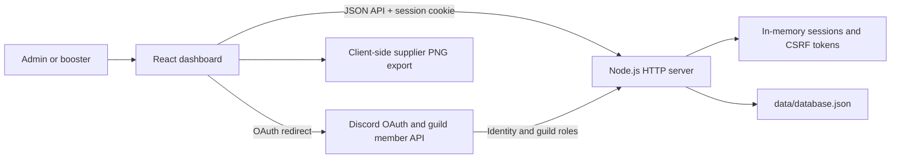
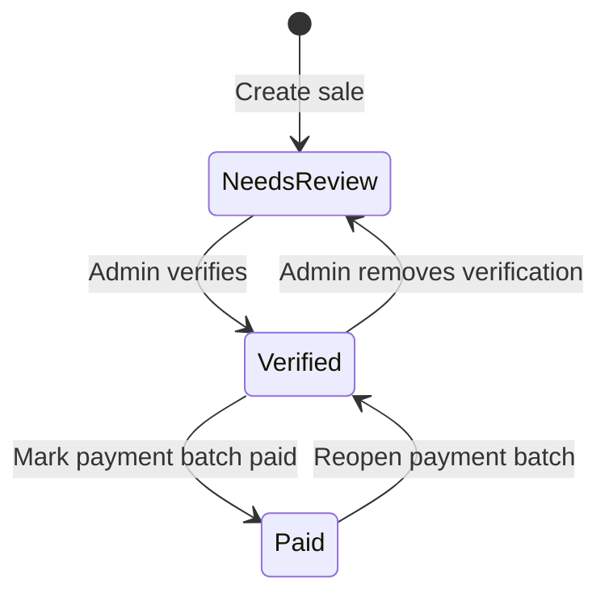
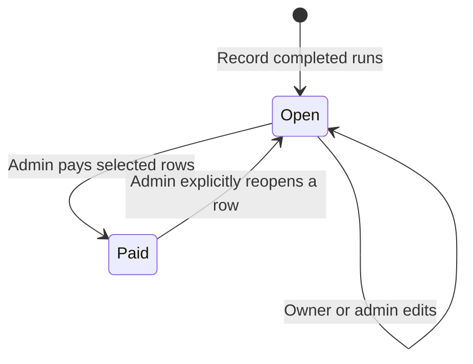
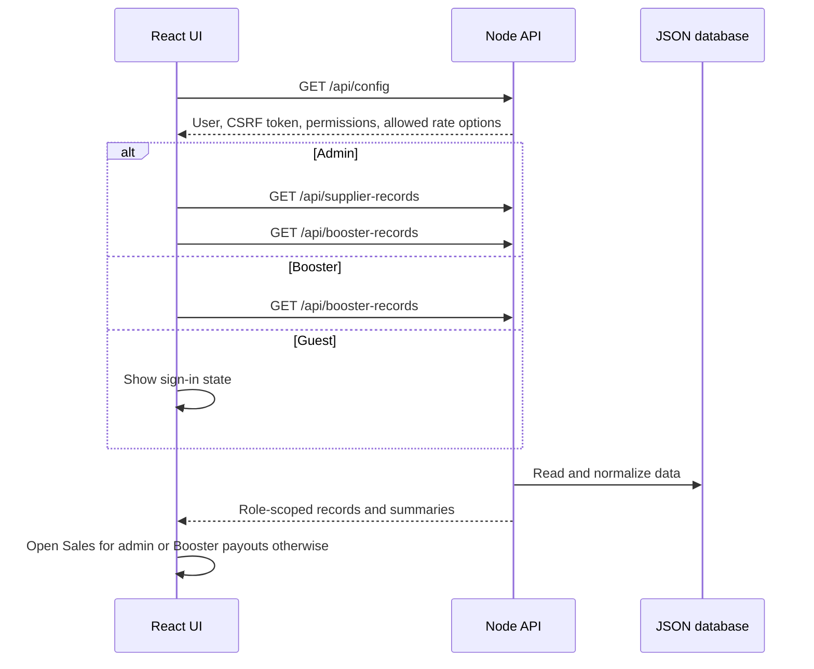

# Moonlight Ledger: System Design and Workflow Guide

## 1. Purpose

Moonlight Ledger is a role-based operations dashboard for a World of Warcraft boosting business. It tracks supplier sales, supplier payment batches, booster run payouts, saved rates, and profit reporting.

Discord is the identity and authorization provider. The application is not a Discord bot process: it does not connect to the Discord Gateway or listen for Discord events. Users sign in through Discord OAuth, and the server maps configured guild roles to either `admin` or `booster` access.

This document is the architectural and workflow reference for the whole project. It describes the current implementation, the design principles that should remain stable, the main product workflows, and the preferred engineering workflow for future changes.

## 2. System at a Glance



### Technology stack

| Layer | Current technology | Responsibility |
| --- | --- | --- |
| Runtime | Node.js 20+ using ES modules | Runs the HTTP API, OAuth flow, and static frontend hosting |
| Backend | Built-in `node:http` server | Routing, validation, permissions, persistence, and reporting |
| Frontend | React 19 and Vite 6 | Role-aware screens, forms, tables, filters, and action orchestration |
| UI system | Tailwind CSS 4, shadcn-style components, Radix UI | Reusable accessible controls and semantic design tokens |
| Record tables | TanStack Table 8 | Stable identity, sorting, pagination, selection, and column visibility |
| Persistence | Local JSON file | Rates and supplier/booster records |
| Authentication | Discord OAuth 2 | Discord identity and configured guild-role lookup |
| Tests | Node test runner, Vitest, Testing Library | Domain logic and interactive table regression coverage |

### Main entry points

- `server.js`: backend, OAuth, sessions, API routes, persistence, and static serving.
- `src/main.jsx`: React bootstrap and top-level error boundary.
- `src/App.jsx`: client-side orchestration, permissions, polling, actions, and page composition.
- `src/components/`: pages, domain components, shared data table, and UI primitives.
- `src/api.js`: shared browser API request wrapper and CSRF header handling.
- `lib/profitReport.js`: framework-independent profit calculation.
- `data/database.json`: runtime data; intentionally ignored by Git.
- `.workflows/` and `.agents/`: repository guidance for feature, bug, refactor, review, test, security, and documentation work.

## 3. Architectural Approach

### 3.1 Server-authoritative business rules

The React interface improves usability, but the server is the source of truth for permissions, valid state transitions, saved monetary values, and persisted records. Hiding a tab or disabling a button is never considered sufficient authorization.

Every protected route checks the current server-side session. Every non-read action also requires the session's CSRF token through `X-CSRF-Token`.

### 3.2 Snapshot monetary rates

Supplier and booster defaults are used only when a new record is created. Each record stores `rateAtRecord`, and its total is derived from that saved value:

```text
supplier totalCost = quantity × rateAtRecord
booster totalBalance = quantity × rateAtRecord
```

This is a core accounting invariant. Editing, archiving, or restoring a default rate must not recalculate historical records. An administrator may explicitly change a saved record rate through an authorized record edit, but a default-rate change alone never does so.

### 3.3 Explicit workflow states

Supplier records use two independent state flags:



- `correct = false`: the record needs review and is not payable.
- `correct = true, paid = false`: the record is verified and eligible for a supplier batch.
- `paid = true`: the record belongs to paid history and has payment audit fields.

Booster records use a simpler open/paid lifecycle:



### 3.4 Small frontend layers

Frontend responsibilities are split by concern:

- `App.jsx` owns session-level data, background refresh, confirmation orchestration, and API-backed mutations.
- Page components own view-specific filters, selection, summaries, and layout.
- Forms collect and submit new domain records.
- Table components own TanStack state, cell rendering, inline edit drafts, sorting, and pagination.
- `src/components/ui/` contains reusable presentation primitives.
- `src/utils/` contains deterministic formatting, batch, selection, and export logic.

New domain calculation logic should be extracted into a testable utility rather than embedded in a large component or duplicated between the client and server.

### 3.5 Derived data from one source

Visible totals and bulk-action payloads should be derived from the same filtered record collection. For example, the supplier batch summary, selected count, exported rows, and paid rows all originate from the same eligible records. This prevents a displayed total from drifting away from the records actually submitted.

TanStack tables use the domain record ID as row identity. A visual array index must never be used for selection or mutation because sorting, filtering, pagination, and polling can reorder rows.

### 3.6 Safe bulk actions

Bulk payment actions follow four steps:

1. The client derives eligible records by stable ID.
2. The user sees the exact count, total, and any review warnings.
3. A confirmation dialog is required.
4. The server revalidates every submitted ID immediately before changing state.

If any selected row is no longer eligible, the whole request is rejected so the user can refresh and review the batch again.

## 4. Runtime and Request Flow

### 4.1 Startup

1. `server.js` loads `.env` values without overwriting variables already present in the process environment.
2. It selects production static assets from `dist/` when present, otherwise the files in `public/`.
3. `npm run dev` starts Vite as middleware for source modules and hot reload.
4. The JSON database is created from built-in defaults when `data/database.json` does not exist.
5. Every database read normalizes old and current records before the route uses them.
6. The HTTP server listens on `PORT`, defaulting to `3000`.

### 4.2 Initial browser load



The config response deliberately scopes configuration data. Administrators receive full supplier and booster rate rows. Non-admin users receive only active booster level names with rate values removed; actual payout calculation stays on the server.

### 4.3 Background refresh

The app refreshes mutable data every 15 seconds while the document is visible. A hidden document schedules a 60-second visibility check but does not fetch record data until visible again.

Polling follows the active page:

- Supplier ledger, supplier history, and rate settings may refresh supplier records.
- Booster payouts and rate settings may refresh booster records.
- Profit reporting increments a refresh version and reloads the current report.
- Permission and session configuration is checked on every polling cycle.

Race protection prevents a background response from overwriting a newer foreground action. Unsaved rate-setting drafts are preserved while the rate page is active. Filters and form-local state are also kept because record polling updates shared data rather than remounting the entire application.

Background failures are intentionally quiet. Initial-load and user-triggered failures are shown through alerts or toast notifications.

## 5. Authentication, Authorization, and Security

### 5.1 Discord sign-in workflow

```mermaid
sequenceDiagram
    participant User
    participant Server
    participant Discord

    User->>Server: GET /auth/discord
    Server->>Server: Create expiring OAuth state
    Server-->>User: Redirect to Discord authorization
    Discord-->>Server: Callback with code and state
    Server->>Server: Validate state and expiry
    Server->>Discord: Exchange code for access token
    Server->>Discord: Read user profile
    Server->>Discord: Read configured guild membership
    Server->>Server: Map roles; admin takes precedence
    Server-->>User: Set signed session cookie and redirect to /
```

Required OAuth scope:

```text
identify guilds.members.read
```

No Discord Gateway Intents are required because the application does not establish a gateway connection.

### 5.2 Role matrix

| Capability | Guest | Booster | Admin |
| --- | :---: | :---: | :---: |
| Sign in with Discord | Yes | Yes | Yes |
| View supplier ledger and history | No | No | Yes |
| Create, edit, verify, delete supplier records | No | No | Yes |
| Export and pay supplier batches | No | No | Yes |
| Reopen supplier batches | No | No | Yes |
| View booster records | No | Own records only | All records |
| Create booster run records | No | Yes | Yes |
| Edit or delete open booster records | No | Own only | All |
| Mark booster payouts paid | No | No | Yes |
| View profit report | No | No | Yes |
| Manage default rates | No | No | Yes |

The server filters booster results by `discordId` for a booster session. The absence of an `All records` tab is therefore only a UI reflection of an already-enforced API boundary.

### 5.3 Session model

- The browser cookie contains only a signed opaque session ID.
- Session details and CSRF tokens are held in an in-memory `Map` on the server.
- Cookies use `HttpOnly`, `SameSite=Lax`, `Path=/`, and a configured maximum age.
- `Secure` is enabled when `COOKIE_SECURE=true` or `NODE_ENV=production`.
- Sessions default to 12 hours and are removed when expired or when the user logs out.
- Restarting the server signs everyone out because sessions are not persisted.

### 5.4 HTTP protections

- Mutating requests require a valid session-specific CSRF token.
- JSON request bodies are limited to 1 MB.
- API responses use `Cache-Control: no-store`.
- Security headers include CSP, `nosniff`, same-origin referrer policy, disabled camera/microphone/geolocation, and frame blocking.
- API errors expose user-safe messages while server-side OAuth connection failures are logged without access tokens.
- Secrets belong in `.env`; `.env` and `data/database.json` are ignored by Git.

## 6. Data Model and Invariants

### 6.1 Database root

```text
database
├── supplierServices[]
├── boosterPrices[]
├── armorTypes[]
├── supplierRecords[]
└── boosterRecords[]
```

### 6.2 Rate records

Supplier service:

```js
{ type, price, active }
```

Booster rate:

```js
{ level, price, active }
```

An archived row has `active: false`. It remains available for historical display but cannot be chosen for a new record. Names are required and unique without regard to letter case; prices must be finite numbers greater than or equal to zero. At least one row must remain in each rate collection, although all rows may technically be archived.

### 6.3 Supplier record

Important fields include:

```js
{
  id,
  date,
  buyerName,
  serviceType,
  quantity,
  armorType,
  correct,
  paid,
  note,
  rateAtRecord,
  totalCost,
  createdByDiscordId,
  createdByName,
  createdAt,
  paidAt,
  paidByDiscordId,
  paidByName,
  paymentBatchId
}
```

When a paid supplier batch is reopened, the payment fields are cleared and `lastPaymentBatchId`, `reopenedAt`, `reopenedByDiscordId`, and `reopenedByName` retain recovery context.

### 6.4 Booster record

Important fields include:

```js
{
  id,
  discordId,
  boosterName,
  level,
  quantity,
  note,
  paid,
  rateAtRecord,
  totalBalance,
  createdAt,
  paidAt,
  paidByDiscordId,
  paidByName,
  boosterPaymentBatchId
}
```

Identity fields come from the authenticated session, never from a client-supplied booster name or Discord ID.

### 6.5 Normalization and compatibility

Every read runs `normalizeDb` so older records remain usable:

- Missing `active` flags become active.
- Quantities and booleans are normalized.
- Missing saved rates are inferred first from saved total divided by quantity, then from the current matching default.
- Totals are recalculated from the resolved saved rate and quantity.
- Legacy paid supplier rows receive a deterministic virtual payment batch ID.

This compatibility behavior should be preserved during storage migrations.

## 7. Product Workflows

### 7.1 Supplier sale and payment workflow

Administrator-only flow:

1. Create a sale with date, buyer, active service, quantity, armor stack, and optional note.
2. The server snapshots the service rate and stores the record as unverified and unpaid.
3. Review or edit the row, including its explicitly saved rate when necessary.
4. Mark the record verified (`correct = true`).
5. Filter the unpaid ledger; the matching verified unpaid rows define the batch. There is no separate batch-selection column.
6. Review the derived row count, total, service/rate summary, and warnings.
7. Export the same batch to PNG if an external payment artifact is needed.
8. Confirm `Mark batch paid`.
9. The server revalidates all IDs, applies one `paidAt` timestamp and one `spb_...` batch ID, and moves the rows into paid history.

Unverified or already-paid records can never enter a supplier payment batch.

### 7.2 Supplier paid-history workflow

Paid history supports filtering by buyer, service, paying administrator, payment date, and original sale date. Records are grouped by `paymentBatchId`, showing the paying admin, timestamp, row count, and total.

An administrator can:

- Expand a batch and review its original records.
- Re-export the batch as a PNG.
- Reopen the complete batch after a destructive confirmation.

Reopening returns every row in that batch to the unpaid ledger without changing its sale details or saved rate.

### 7.3 Supplier PNG export workflow

The export runs entirely in the browser:

1. Keep verified records only.
2. Build an SVG report with title, date range, row count, total, detailed records, and service summary.
3. Draw the SVG into a canvas.
4. Convert the canvas to a PNG blob.
5. Trigger a download named `Sale-{firstVerifiedDate}-{lastVerifiedDate}.png`.

Only verified record dates determine the filename range. Paid batch exports use the same renderer with a paid-batch title and context.

### 7.4 Booster run and payout workflow

For a booster:

1. Sign in with an allowed booster role.
2. Record a Mythic+ key level, whole-number run count, and optional note.
3. The server takes identity from the session and snapshots the configured level rate.
4. View only personal open or paid rows.
5. Edit or delete only personal unpaid rows. A booster cannot edit a saved rate or payment status.

For an administrator:

1. View all booster records and aggregate open balances by booster.
2. Filter by open/paid/all, booster, level, or date range.
3. Review warning rows, select exact open rows, and inspect the selected count and payout total.
4. Confirm payment.
5. The server revalidates the selected IDs and assigns one timestamp and one `bpb_...` batch ID.

Review warnings flag missing notes, zero payout values, or unusually high run counts. They prompt human review but do not independently change server eligibility.

### 7.5 Default-rate workflow

Administrator-only flow:

1. Add, rename, or change a supplier service or booster key-level default.
2. Resolve duplicate names and invalid values before saving.
3. Archive rows that should no longer appear in new-record forms.
4. Confirm archival when historical records use that rate name.
5. Save the complete cleaned rate collection through its API endpoint.

Rate edits are draft state until saved. Polling does not overwrite drafts while the rate page is active.

### 7.6 Profit-report workflow

Profit reporting is administrator-only and uses payment timestamps rather than original sale/run dates:

```text
net profit = paid supplier total - paid booster payout total
```

The user can select:

- One payment day, grouped daily.
- One payment month, grouped monthly.
- A custom payment date range, grouped daily.

Only records with `paid = true` and a valid `paidAt` date inside the requested inclusive range are counted. Reopening a payment removes it from future report results because it is no longer paid.

## 8. API Contract Summary

All bodies and responses are JSON unless a route redirects the browser.

| Method | Route | Access | Purpose |
| --- | --- | --- | --- |
| `GET` | `/api/config` | Public, role-scoped | Session, permissions, CSRF token, and allowed configuration |
| `POST` | `/api/logout` | Signed-in session | Clear session |
| `GET` | `/api/supplier-records` | Admin | Unpaid rows, paid rows, and unpaid verified summary |
| `POST` | `/api/supplier-records` | Admin | Create an unverified sale |
| `PATCH` | `/api/supplier-records/:id` | Admin | Edit, verify, or explicitly change payment state |
| `DELETE` | `/api/supplier-records/:id` | Admin | Delete a supplier row |
| `POST` | `/api/supplier-records/mark-paid` | Admin | Pay the submitted filtered, verified rows as one batch |
| `POST` | `/api/supplier-payment-batches/:id/reopen` | Admin | Reopen a complete supplier batch |
| `GET` | `/api/booster-records` | Admin or booster | All rows for admin; own rows for booster |
| `POST` | `/api/booster-records` | Admin or booster | Create an own-identity run payout row |
| `PATCH` | `/api/booster-records/:id` | Owner of open row or admin | Edit allowed payout fields |
| `DELETE` | `/api/booster-records/:id` | Owner of open row or admin | Delete an allowed payout row |
| `POST` | `/api/booster-records/mark-paid` | Admin | Pay selected open booster rows |
| `GET` | `/api/profit-report` | Admin | Daily or monthly paid-date profit aggregation |
| `PUT` | `/api/prices/supplier` | Admin | Replace validated supplier defaults |
| `PUT` | `/api/prices/booster` | Admin | Replace validated booster defaults |
| `GET` | `/auth/discord` | Public | Start OAuth authorization |
| `GET` | `/auth/discord/callback` | Public with valid state | Complete sign-in and create a session |

## 9. Interface and Visual Design Approach

### 9.1 Product character

The interface is a calm, finance-first operations workspace for suppliers, boosters, and the administrator acting as middleman. Its visual direction is **Moonwell Ledger**: moonlit navy foundations, misty blue actions, desaturated teal completion states, and restrained aged-gold review/admin cues. World of Warcraft is present through naming, the Moonlight avatar, and a subtle nocturnal atmosphere rather than neon, esports, or ornate fantasy decoration that would slow repeated financial work.

### 9.2 Semantic design system

`src/index.css` is the semantic source of truth for background, foreground, cards, muted surfaces, primary actions, destructive actions, success, review/warning, borders, inputs, focus rings, radii, elevation, motion, and typography. `public/styles.css` maps the remaining active legacy class names onto the same palette while the UI migration continues. Components should use semantic tokens and shared variants instead of introducing isolated color literals.

The palette communicates workflow meaning:

- Misty blue: primary actions, active navigation, selection, and links.
- Desaturated teal: verified, paid, and positive outcomes.
- Aged gold: review attention, rate administration, and other deliberate admin-only context.
- Muted rose: destructive actions, negative totals, and errors.
- Deep navy and blue-gray: application background, raised work surfaces, borders, and secondary information.

Typography uses the local system UI family for fast rendering and clear financial scanning. Headings are compact rather than theatrical, while quantities, balances, and report totals use tabular figures so changing values do not shift horizontally.

### 9.3 Interaction hierarchy

- Primary workflow actions remain visible and text-labeled; Lucide icons may support labels but do not replace them.
- Destructive actions use destructive styling and a confirmation dialog.
- Secondary row actions may use compact controls when space is limited.
- Soft borders and consistent low elevation establish hierarchy without glassy or glowing effects.
- Cards establish page sections; badges communicate state without replacing text or relying on color alone.
- Empty, loading, unauthorized, error, and success states remain visually distinct.
- Motion is restrained to short state transitions and is removed when `prefers-reduced-motion` is enabled.

### 9.4 Tables and responsive behavior

- The page shell and primary navigation must fit at 375px without ordinary-page horizontal overflow. The main navigation reflows into a grid rather than becoming a viewport-wide scrolling strip.
- Tables favor compact rows, sticky context, sorting, pagination, and **contained** horizontal overflow over hiding critical columns.
- Default page size is 25, with 50 and 100 available.
- Supplier export and payment batches are defined by the current filters plus verified status; unverified rows are never included.
- Booster payment selection is limited to eligible rows and reconciled when polling changes record state.
- The booster header checkbox operates on the current eligible page rather than silently selecting unseen data.
- Status, selection, and edit states use both labels and row treatment; color is not the only signal.
- Flex/grid children that contain user names, notes, IDs, or other long tokens must be shrinkable and use safe wrapping; normal prose must not use `word-break: break-all`.

### 9.5 Accessibility

- Use semantic form labels and buttons.
- Keep keyboard focus visible.
- Expose sort direction and pagination actions through accessible names.
- Restore focus after dialogs and support escape/cancel behavior through Radix primitives.
- Maintain comfortable touch targets, with 44px controls for primary navigation and routine actions.
- Preserve readable 16px form text on small screens to avoid mobile input zoom, while desktop form density may be more compact.
- Do not use color as the only status cue; retain labels such as Verified, Needs review, Paid, and Open.
- Respect `prefers-reduced-motion`.

## 10. Engineering Workflows

The repository includes concise workflow recipes under `.workflows/`. The shared sequence below is the default for meaningful changes.

### 10.1 Add a feature

1. Read the current page, components, utilities, API routes, and relevant tests completely.
2. Define the layer ownership and API contract before changing UI behavior.
3. Split the work into independently verifiable steps.
4. Implement server validation and authorization with the contract.
5. Implement or extend `src/api.js` when shared request behavior is needed.
6. Build page composition, domain components, and UI states.
7. Add domain and interaction tests, including a failure or unauthorized path.
8. Perform a security review for authentication, identity, permissions, input, or session changes.
9. Run the automated checks and complete a browser smoke test.
10. Update this document and requirement/roadmap documents when behavior or architecture changes.

### 10.2 Fix a bug

1. Reproduce the symptom and trace it to the authoritative layer.
2. Identify the root cause before editing.
3. Implement the smallest behavior-correct fix.
4. Add a regression test that fails for the original defect.
5. Run domain tests, UI tests, syntax checks, and the production build as applicable.
6. Verify the happy path and the original failure path in the browser.

### 10.3 Refactor a module

1. Establish or improve coverage before moving behavior.
2. Identify single-responsibility violations and extraction boundaries.
3. Keep the refactor behavior-preserving; do not mix it with a product-rule redesign.
4. Prefer domain utilities and focused components over a new general-purpose abstraction without multiple real consumers.
5. Run tests and the production build after the extraction.

### 10.4 Review a change

Review in this order:

1. Correctness of monetary totals and state transitions.
2. Server-side authorization and response scoping.
3. CSRF, session, input validation, and error-data exposure.
4. Stable IDs and bulk-action eligibility after filtering/pagination/polling.
5. Historical-rate preservation.
6. Loading, empty, error, unauthorized, confirmation, and success states.
7. Keyboard, responsive, and reduced-motion behavior.
8. Test coverage and production build status.

A change that introduces an unresolved critical/high security issue, breaks historical accounting, or lets a bulk action mutate unintended rows should not be merged.

## 11. Verification Commands

| Command | What it verifies |
| --- | --- |
| `npm run dev` | Node server with Vite middleware for local development |
| `npm start` | Node server using built frontend assets when available |
| `npm run check` | Syntax of `server.js` |
| `npm test` | Node domain tests in `test/` |
| `npm run test:ui` | Vitest and Testing Library component tests |
| `npm run build` | Production Vite bundle |

Minimum completion checks for most product changes:

```text
npm run check
npm test
npm run test:ui
npm run build
```

Manual smoke coverage should include both admin and booster roles, desktop and mobile widths, keyboard navigation, one successful mutation, and one rejected or error path in the changed workflow.

## 12. Environment and Deployment

Required configuration is documented in `.env.example`:

- `PORT`
- `DISCORD_CLIENT_ID`
- `DISCORD_CLIENT_SECRET`
- `DISCORD_REDIRECT_URI`
- `DISCORD_GUILD_ID`
- `DISCORD_ADMIN_ROLE_IDS`
- `DISCORD_BOOSTER_ROLE_IDS`
- `SESSION_SECRET`
- `SESSION_MAX_AGE_HOURS`
- `COOKIE_SECURE`

Production checklist:

1. Use a long random `SESSION_SECRET`; do not use the development fallback.
2. Serve over HTTPS and enable secure cookies.
3. Register the exact production Discord redirect URI.
4. Configure the guild and minimum required admin/booster role IDs.
5. Run tests and create the production Vite build.
6. Back up `data/database.json` before deployment or data-model changes.
7. Ensure the process has write access only to the required data directory.
8. Verify that `.env` and runtime data are not included in source control or public assets.

## 13. Current Constraints and Evolution Path

The current architecture is appropriate for a small, single-process internal workspace, but it has known scaling boundaries:

- JSON persistence uses synchronous whole-file reads and writes.
- Concurrent writes are not coordinated across multiple server processes.
- Sessions and OAuth states are in memory and disappear on restart.
- There is no persistent audit-log collection; some actor/timestamp metadata is stored on records.
- `server.js` contains routing, persistence, auth, and business logic in one large module.
- Automated coverage is focused and does not yet cover every route and permission boundary.
- Legacy CSS remains imported in a lower-priority cascade layer during the UI migration.

The recommended next backend evolution is SQLite with migrations and explicit tables for supplier records, booster records, rates, payment batches, sessions if needed, and audit events. Any migration must preserve IDs, saved rates, totals, paid timestamps, batch identifiers, and actor metadata.

As the backend grows, extract these concerns in order:

1. Database repository and atomic transaction layer.
2. Session and OAuth service.
3. Supplier, booster, rate, and reporting domain services.
4. Route modules that translate HTTP input/output only.
5. Persistent audit logging for edit, verify, pay, reopen, delete, and rate changes.

## 14. Non-Negotiable Guardrails

Future changes must preserve these rules unless the product requirements explicitly replace them:

1. Discord is the only sign-in mechanism.
2. The server enforces every permission boundary.
3. Boosters see and mutate only allowed personal records.
4. Only administrators can verify supplier records or complete payments.
5. Unverified supplier rows cannot be paid or exported as payable rows.
6. Bulk actions use stable domain IDs and server-side revalidation.
7. Default-rate changes never rewrite historical saved rates.
8. Profit uses paid state and saved payment timestamps.
9. Mutating requests require CSRF protection.
10. Secrets and runtime ledger data never enter the frontend bundle or Git history.
11. Dangerous actions remain explicit, confirmed, and recoverable where the product supports recovery.
12. UI changes include accessible loading, empty, error, unauthorized, and responsive states.

## 15. Definition of Done

A project change is complete when:

- The behavior matches the product requirement and this system model.
- Server-side access and validation are correct for guest, booster, and admin roles.
- Saved monetary data and historical records remain stable.
- Foreground actions refresh the affected view without waiting for polling.
- Background refresh cannot overwrite newer user actions or unsaved drafts.
- Relevant automated tests pass.
- The production build succeeds.
- The changed workflow has been smoke-tested at appropriate viewport sizes and with keyboard interaction.
- Documentation is updated when setup, API contracts, data shape, roles, or workflow behavior changes.
